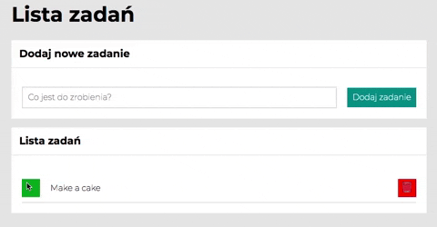

# To Do List App

 
## Preview of my To Do List App :leftwards_arrow_with_hook:
[Tap here!](https://tomasz-szczepanek.github.io/to-do-list/)

## General info
**To Do List** a simple application that allows you to organize tasks / purchases on a given day. With this application, you can make a list as long as you need, and after completing a task / activity, you can mark it as done or delete it using the trash icon.

## Used technologies
- HTML
- BEM convention
- JavaScript
- CSS
  - Flexbox
  - Grid

## Simple instruction
  
  1. Enter the content of the task in the field provided in the "Dodaj nowe zadanie" section.

   

  2. Click on "Dodaj zadanie" button to add your task to the list.

   

  3. When the task is completed, you can click the green button. After clicking, the check icon will be displayed and the task content will be crossed out.

   
    
 4. If you want to delete a given task, click the red button with trash icon.
 
   
